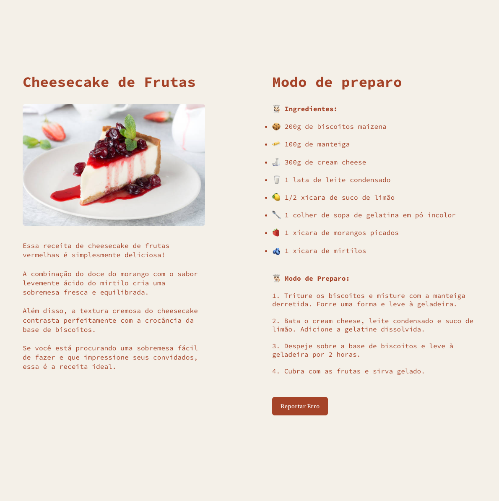
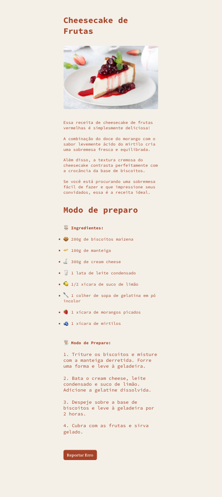

#  🍰 Cheesecake • Projeto Explorer (Community) 
🇺🇸 _Cheesecake • Explorer Challenge (Community)_

## 👩🏻‍💻 Sobre este site

🇧🇷 Este projeto estudei sobre o conceito de clamp e aprendi qual é a melhor maneira de usar e quando essa técnica é a melhor opção. O assunto é extenso porque podem ser muitas as variáveis, como tudo em CSS... Mas não é algo só para font-size.
O clamp na verdade é basicamente um shorthand para a construção de um valor "length" para o font-size, por exemplo, ou para o width de uma div.
Ele ajuda a incrementar o min() ou max() adicionando um entretanto entre um valor mínimo e máximo, ou seja, uma expressão como essa width: clamp(200px, 50%, 600px); significa que a div terá no máximo 600px, entretanto, ela não pode ter mais de 50% da largura do pai, e nem menos de 200px de largura.  

## 👩🏻‍💻 _About this website_ 
🇺🇸 _In this project I studied the concept of clamp and learned what is the best way to use it and when this technique is the best option. The subject is extensive because there can be many variables, like everything in CSS... But it's not just about font-size.
The clamp is actually basically a shorthand for constructing a "length" value for the font-size, for example, or for the width of a div.
It helps to increase min() or max() by adding a parameter between a minimum and maximum value, that is, an expression like this width: clamp(200px, 50%, 600px); This means that the div will be a maximum of 600px, however, it cannot be more than 50% of the parent's width, nor less than 200px wide._

# 📸 Screenshot Desktop and Mobile 

# 🚀 Techologies
🇧🇷 Esse projeto foi desenvolvido com as seguintes tecnologias: 

🇺🇸 This project was developed with the following technologies: 

- [HTML](../index.html)
- [CSS](../style.css)
- [Git e Github](https://github.com/)
- [Figma](www.figma.com)
- [Rocketseat](www.rocketseat.com.br)

##

- 🔗 **[Online project](../index.html)**

##
🗓️ Jan. 2024

## 
                      ・Developed with ♡ by BM